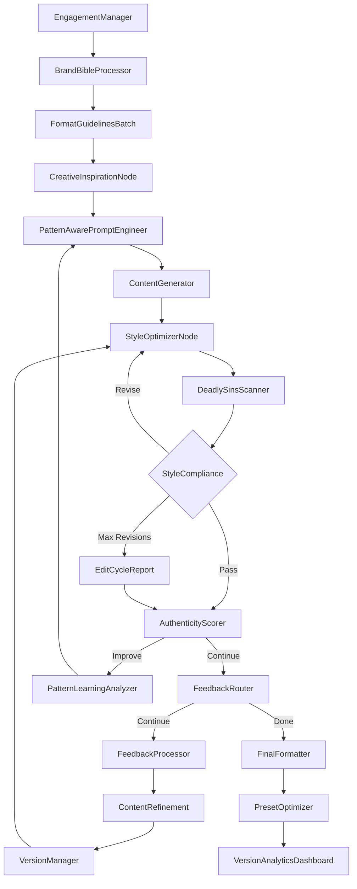

# Design Doc: PR Firm Content Generation System

> Please DON'T remove notes for AI

## Requirements

> Notes for AI: Keep it simple and clear.
> If the requirements are abstract, write concrete user stories

### Core Problem
Marketing teams and individuals need to create platform-optimized, brand-consistent content across multiple channels while avoiding AI fingerprints that reduce authenticity. Manual content creation is time-consuming and often results in inconsistent messaging across platforms.

### User Stories
- As a marketing manager, I want to generate content for multiple platforms from a single topic while maintaining consistent brand voice across all channels
- As an individual professional, I want to create personal brand content that reflects my unique voice and expertise without sounding AI-generated
- As a brand manager, I want all content to strictly avoid the "7 Deadly Sins" of AI writing (em dashes, rhetorical contrasts, etc.) so our content maintains authenticity
- As a content creator, I want to iteratively refine generated content with specific feedback and see version history for rollback capability
- As a user, I want to save my brand configuration as presets so I don't have to re-enter information each time

### The 7 Deadly Sins of AI-Generated Content

**Critical Detection Requirements**: The system must identify and eliminate all instances of these patterns:

1. **Em Dash Usage**: Never use an em dash (—) in any context
   
2. **Rhetorical Contrasts**: Never use "It's not just A; it's B" formulations where B reframes or repositions A in a more transformational or emotionally resonant way
   
3. **Antithesis**: Never use contrasting two opposing ideas in a balanced structure
   - Example to avoid: "It's not just software; it's a revolution"
   
4. **Paradiastole**: Never use rhetorical reclassification that softens or elevates concepts by recasting them
   - Example to avoid: "It's not laziness; it's strategic delegation"
   
5. **Reframing Contrasts**: Never shift the meaning or perception of something by putting it in a different light
   - Example to avoid: "It's not just a cost; it's an investment"
   
6. **Chiasmus-like Contrast**: Never use mirrored or inverted idea structures for emphasis
   - Example to avoid: "It's not what AI does to you; it's what you do with AI"
   
7. **Tagline Framing**: Never elevate a product or idea by contrasting it with a more mundane label
   - Example to avoid: "It's not just a car; it's a lifestyle"

### Constraints
- No external service integrations (no scheduling, posting, or CRM connections)
- Only connects to LLMs through OpenRouter utility functions
- Must detect and remove all "7 Deadly AI Sins" patterns with zero tolerance
- Maximum 5 revision cycles for style compliance before manual review required
- Output must be formatted markdown with copy-to-clipboard functionality

## Flow Design

> Notes for AI:
> 1. Consider the design patterns of agent, map-reduce, rag, and workflow. Apply them if they fit.
> 2. Present a concise, high-level description of the workflow.

### Applicable Design Pattern:

1. **Workflow Pattern**: Sequential pipeline for content generation with iterative revision loops
2. **Batch Pattern**: Process multiple platforms in parallel during formatting and content generation
3. **Agent Pattern**: Dynamic brand voice interpretation and feedback-driven content refinement

### Flow High-Level Design:

1. **Engagement Manager**: Captures user inputs through GUI and manages preset configurations
2. **Brand Bible Processor**: Converts descriptive brand text into structured voice parameters
3. **Format Guidelines Batch**: Generates platform-specific formatting rules and constraints
4. **Creative Inspiration Node**: Uses LLM prompts to generate high-engagement examples without external web searches
5. **Pattern-Aware Prompt Engineer**: Enhances prompts with positive writing alternatives to prevent AI patterns
6. **Content Generator**: Creates initial drafts optimized for each platform
7. **Style Optimizer**: Merged node for initial cleanup and AI pattern removal while preserving brand voice
8. **Deadly Sins Scanner**: Detects specific AI patterns that must be eliminated
9. **Style Compliance Check**: Validates final content (max 5 revision cycles)
10. **Authenticity Scorer**: Evaluates human-like qualities beyond pattern avoidance
11. **Feedback Router**: Handles user feedback for iterative refinement with version control
12. **Pattern Learning Analyzer**: Improves prompt engineering based on revision history
13. **Content Refinement**: Applies user-requested changes
14. **Version Manager**: Tracks content versions for rollback capability
15. **Final Formatter**: Outputs clean markdown with copy buttons
16. **Preset Optimizer**: Learns from user preferences to improve preset configurations
17. **Version Analytics Dashboard**: Provides insights into pattern reduction and revision efficiency



## Utility Functions

> Notes for AI:
> 1. Understand the utility function definition thoroughly by reviewing the doc.
> 2. Include only the necessary utility functions, based on nodes in the flow.

1. **Call LLM** (`utils/call_llm.py`)
   - *Input*: messages (list[dict]), model (str), temperature (float)
   - *Output*: response (str)
   - *Necessity*: Core LLM interaction via OpenRouter for all content generation and refinement

2. **Brand Bible Parser** (`utils/brand_bible_parser.py`)
   - *Input*: brand_text (str), individual_vs_brand (str)
   - *Output*: structured_voice (dict), tone_guidelines (dict)
   - *Necessity*: Converts descriptive brand information into LLM-readable parameters

3. **Deadly Sins Detector** (`utils/deadly_sins_detector.py`)
   - *Input*: text (str)
   - *Output*: violations (dict), severity_score (float), violation_positions (list)
   - *Necessity*: Detects all 7 AI fingerprint patterns:
     - Em dash detection (regex pattern for "—")
     - Rhetorical contrast patterns ("It's not just X; it's Y")
     - Antithesis structure detection
     - Paradiastole pattern matching
     - Reframing contrast identification
     - Chiasmus-like structure detection
     - Tagline framing pattern recognition

4. **Content Sanitizer** (`utils/content_sanitizer.py`)
   - *Input*: text (str), violations (dict), brand_voice (dict)
   - *Output*: sanitized_text (str)
   - *Necessity*: Removes specific AI fingerprints while preserving brand voice and meaning:
     - Replace em dashes with periods, commas, or sentence breaks
     - Rewrite rhetorical contrasts as direct statements
     - Convert antithesis to straightforward descriptions
     - Transform paradiastole into clear explanations
     - Eliminate reframing contrasts with factual statements
     - Replace chiasmus patterns with linear explanations
     - Convert tagline framing to descriptive language

5. **Platform Formatter** (`utils/platform_formatter.py`)
   - *Input*: platform (str), brand_voice (dict), topic (str)
   - *Output*: formatting_guidelines (dict)
   - *Necessity*: Creates platform-specific character limits and style requirements

6. **Creative Inspiration Generator** (`utils/creative_inspiration.py`)
   - *Input*: topic (str), platform (str), brand_voice (dict)
   - *Output*: inspiration_examples (list[str])
   - *Necessity*: Uses LLM prompts to generate high-engagement content examples without external web searches

7. **Version Manager** (`utils/version_manager.py`)
   - *Input*: content (dict), action (str), user_feedback (str)
   - *Output*: version_id (str), version_metadata (dict)
   - *Necessity*: Manages content versions for rollback and comparison

8. **Presets Manager** (`utils/presets_manager.py`)
   - *Input*: action (str), preset_data (dict), preset_name (str)
   - *Output*: preset_id (str) or loaded_preset (dict)
   - *Necessity*: Saves and loads brand configurations for reuse

9. **Feedback Parser** (`utils/feedback_parser.py`)
   - *Input*: user_feedback (str), content_pieces (dict)
   - *Output*: edit_instructions (dict), edit_type (str)
   - *Necessity*: Interprets user feedback into actionable content modifications

10. **Markdown Formatter** (`utils/markdown_formatter.py`)
    - *Input*: content_pieces (dict), platform_list (list)
    - *Output*: formatted_markdown (str), copy_buttons_html (str)
    - *Necessity*: Formats final output with platform sections and copy functionality

11. **Authenticity Scorer** (`utils/authenticity_scorer.py`)
    - *Input*: text (str), brand_voice (dict)
    - *Output*: authenticity_score (float), feedback (dict)
    - *Necessity*: Evaluates human-like qualities beyond pattern avoidance

12. **Pattern Learner** (`utils/pattern_learner.py`)
    - *Input*: version_history (list), violations_data (dict)
    - *Output*: learned_patterns (dict), prompt_improvements (dict)
    - *Necessity*: Analyzes persistent patterns to improve future prompt engineering

## Node Design

### Shared Store

> Notes for AI: Try to minimize data redundancy

```python
shared = {
    "user_config": {
        "individual_or_brand": "individual",  # or "brand"
        "name": "John Doe",
        "brand_name": None,  # only if "brand" selected
        "model": "openrouter/anthropic/claude-3.5-sonnet",
        "temperature": 0.7
    },
    "task_requirements": {
        "topic": "Main topic or goal for the content",
        "platforms": ["email", "linkedin", "instagram", "twitter", "reddit", "blog"],
        "brand_bible_text": "Descriptive text about brand voice, personality, values..."
    },
    "brand_voice": {
        "parsed_attributes": {
            "personality_traits": ["curious", "teacher", "purposeful"],
            "tone": "professional",
            "voice": "confident", 
            "values": ["innovation", "education"],
            "themes": ["AI empowerment", "skill development"]
        },
        "forbidden_patterns": {
            "em_dash": {"pattern": "—", "severity": "critical"},
            "rhetorical_contrast": {"pattern": r"It's not just .+; it's .+", "severity": "critical"},
            "antithesis": {"pattern": r"It's not .+; it's .+", "severity": "critical"},
            "paradiastole": {"pattern": r"It's not .+; it's .+", "severity": "critical"},
            "reframing_contrast": {"pattern": r"It's not just .+; it's .+", "severity": "critical"},
            "chiasmus": {"pattern": r"It's not what .+ to .+; it's what .+ with .+", "severity": "critical"},
            "tagline_frame": {"pattern": r"It's not just .+; it's .+", "severity": "critical"}
        },
        "style_preferences": {
            "sentence_variety": "high",
            "transition_style": "natural",
            "ending_style": "challenging"
        }
    },
    "platform_guidelines": {
        "email": {
            "char_limit": 500,
            "structure": ["subject", "greeting", "body", "cta", "signature"],
            "tone_adjustment": "professional"
        },
        "linkedin": {
            "char_limit": 3000,
            "reveal_cutoff": 210,
            "hashtag_count": 3,
            "tone_adjustment": "thought_leadership"
        },
        "instagram": {
            "char_limit": 2200,
            "reveal_cutoff": 125,
            "hashtag_count": [8, 20],
            "tone_adjustment": "engaging"
        },
        "twitter": {
            "char_limit": 280,
            "thread_threshold": 240,
            "hashtag_count": [0, 3],
            "tone_adjustment": "conversational"
        },
        "reddit": {
            "char_limit": 40000,
            "style_hints": {},  # filled by creative inspiration
            "tone_adjustment": "community_appropriate"
        },
        "blog": {
            "target_words": 1200,
            "structure": "deep_headings",
            "tone_adjustment": "authoritative"
        }
    },
    "creative_inspiration": {
        "examples": [],  # filled by CreativeInspirationNode
        "source_platforms": []
    },
    "content_pieces": {
        "email": {"subject": "...", "body": "..."},
        "linkedin": {"text": "...", "hashtags": ["#tag1", "#tag2", "#tag3"]},
        "instagram": {"caption": "...", "hashtags": ["#tag1", ...]},
        "twitter": {"tweet": "..." or "thread": ["tweet1", "tweet2", ...]},
        "reddit": {"title": "...", "body": "..."},
        "blog": {"title": "...", "body": "..."}
    },
    "quality_control": {
        "deadly_sins_violations": {
            "email": {
                "em_dash": {"count": 0, "positions": []},
                "rhetorical_contrast": {"count": 1, "positions": [45]},
                "antithesis": {"count": 0, "positions": []},
                "paradiastole": {"count": 0, "positions": []},
                "reframing_contrast": {"count": 0, "positions": []},
                "chiasmus": {"count": 0, "positions": []},
                "tagline_frame": {"count": 0, "positions": []}
            },
            "linkedin": {
                "em_dash": {"count": 2, "positions": [120, 340]},
                # etc. for all platforms and all sins
            }
        },
        "revision_count": 0,
        "max_revisions_reached": False,
        "compliance_status": "pending"  # "pass", "revise", "manual_review"
    },
    "version_history": [
        {
            "version_id": "v1",
            "content_pieces": {...},
            "timestamp": "2024-12-27T10:00:00Z",
            "user_feedback": "Make LinkedIn post shorter",
            "changes_made": ["reduced_length", "removed_em_dash"],
            "violations_fixed": ["em_dash", "rhetorical_contrast"]
        }
    ],
    "feedback_state": {
        "awaiting_feedback": False,
        "feedback_type": None,  # "sentence_edit", "general_refinement", "done"
        "user_input": "",
        "selected_content": {}
    },
    "workflow_state": {
        "current_stage": "engagement",
        "completed_stages": [],
        "error_state": None
    }
}
```

### Node Steps

> Notes for AI: Carefully decide whether to use Batch/Async Node/Flow.

1. **EngagementManagerNode**
   - *Purpose*: Handle GUI inputs and preset management
   - *Type*: Regular
   - *Steps*:
     - *prep*: Read any existing preset configurations
     - *exec*: Validate user inputs, load presets if selected
     - *post*: Initialize shared store with user_config and task_requirements

2. **BrandBibleProcessorNode**
   - *Purpose*: Convert descriptive brand text into structured voice parameters
   - *Type*: Regular
   - *Steps*:
     - *prep*: Read brand_bible_text and individual_or_brand setting
     - *exec*: Parse descriptive text, extract personality traits, tone, forbidden patterns
     - *post*: Write structured brand_voice with all 7 deadly sins patterns to shared store

3. **FormatGuidelinesBatch**
   - *Purpose*: Generate platform-specific formatting rules
   - *Type*: BatchNode
   - *Steps*:
     - *prep*: Return list of selected platforms
     - *exec*: For each platform, generate character limits, structure requirements, tone adjustments
     - *post*: Write platform_guidelines to shared store

4. **CreativeInspirationNode**
   - *Purpose*: Use LLM prompts to generate high-engagement examples without external web searches
   - *Type*: Regular
   - *Steps*:
     - *prep*: Read topic, brand_voice, and platform_guidelines
     - *exec*: Call LLM with prompt to generate creative examples for each platform
     - *post*: Store inspiration examples in shared store for prompt engineering

5. **PatternAwarePromptEngineerNode**
   - *Purpose*: Enhance generation prompts with positive writing alternatives to prevent AI patterns
   - *Type*: Regular
   - *Steps*:
     - *prep*: Read brand_voice, platform_guidelines, and creative inspiration
     - *exec*: Generate pattern-aware prompts with few-shot examples of approved vs rejected phrasing
     - *post*: Store enhanced prompts for content generation

6. **ContentGeneratorNode**
   - *Purpose*: Generate initial content drafts for each platform
   - *Type*: Regular (max_retries=2, wait=5)
   - *Steps*:
     - *prep*: Read topic, brand_voice, platform_guidelines, and enhanced prompts
     - *exec*: Generate platform-optimized content using LLM with explicit instructions to avoid all 7 deadly sins
     - *post*: Write content_pieces to shared store

7. **StyleOptimizerNode**
   - *Purpose*: Merged node for initial cleanup, brand voice enforcement, and AI pattern removal
   - *Type*: Regular (max_retries=2, wait=5)
   - *Steps*:
     - *prep*: Read content_pieces and brand_voice
     - *exec*: Apply conservative edits to improve style while maintaining brand voice and avoiding deadly sins
     - *post*: Update content_pieces with edited versions

8. **DeadlySinsScannerNode**
   - *Purpose*: Detect all 7 specific AI fingerprint patterns with precise location tracking
   - *Type*: Regular
   - *Steps*:
     - *prep*: Read content_pieces from shared store
     - *exec*: Scan all content for each of the 7 deadly sins patterns
     - *post*: Write detailed deadly_sins_violations with counts and positions to shared store

9. **StyleComplianceNode**
   - *Purpose*: Final validation and revision loop management
   - *Type*: Regular
   - *Steps*:
     - *prep*: Read content_pieces and revision_count
     - *exec*: Re-scan for any remaining deadly sins violations, increment revision count
     - *post*: Update quality_control; return "pass" (zero violations), "revise" (violations found, <5 revisions), or "manual_review" (≥5 revisions)

10. **EditCycleReportNode**
    - *Purpose*: Generate report when max revisions reached
    - *Type*: Regular
    - *Steps*:
      - *prep*: Read violation history and current content
      - *exec*: Create summary of persistent deadly sins violations requiring manual attention
      - *post*: Write report to shared store, set manual_review flag

11. **AuthenticityScorerNode**
    - *Purpose*: Evaluate content authenticity using multiple dimensions beyond pattern avoidance
    - *Type*: Regular
    - *Steps*:
      - *prep*: Read content_pieces and brand_voice
      - *exec*: Score content on authenticity, engagement, and brand alignment metrics
      - *post*: Return "continue" (needs improvement) or "done" (meets quality thresholds)

12. **FeedbackRouterNode**
    - *Purpose*: Handle user feedback decisions
    - *Type*: Regular
    - *Steps*:
      - *prep*: Read current content_pieces and await user input
      - *exec*: Parse user decision (done/continue with feedback)
      - *post*: Update feedback_state; return "done" or "continue"

13. **FeedbackProcessorNode**
    - *Purpose*: Process specific user feedback
    - *Type*: Regular
    - *Steps*:
      - *prep*: Read user feedback and current content
      - *exec*: Generate specific edit instructions from feedback while ensuring no deadly sins are introduced
      - *post*: Write edit instructions for content refinement

14. **ContentRefinementNode**
    - *Purpose*: Apply user-requested changes
    - *Type*: Regular
    - *Steps*:
      - *prep*: Read edit instructions and current content
      - *exec*: Apply targeted edits based on user feedback while maintaining deadly sins compliance
      - *post*: Update content_pieces with refined versions

15. **VersionManagerNode**
    - *Purpose*: Track content versions for rollback capability
    - *Type*: Regular
    - *Steps*:
      - *prep*: Read current content_pieces and user_feedback
      - *exec*: Create version snapshot with metadata including violations fixed
      - *post*: Append to version_history in shared store

16. **PatternLearningAnalyzerNode**
    - *Purpose*: Analyze persistent patterns across revisions to improve future prompt engineering
    - *Type*: Regular
    - *Steps*:
      - *prep*: Read version_history and deadly_sins_violations
      - *exec*: Identify most recurrent patterns and effective remediation strategies
      - *post*: Update prompt engineering parameters for future generations

17. **FinalFormatterNode**
    - *Purpose*: Format output as markdown with copy buttons
    - *Type*: Regular
    - *Steps*:
      - *prep*: Read final content_pieces and selected platforms
      - *exec*: Generate clean markdown format with platform sections and copy functionality, verify zero deadly sins violations
      - *post*: Write formatted output for user interface display

18. **PresetOptimizerNode**
    - *Purpose*: Learn from user feedback and usage patterns to improve preset configurations
    - *Type*: Regular
    - *Steps*:
      - *prep*: Read version_history and user feedback
      - *exec*: Analyze successful configurations and user preferences
      - *post*: Update preset templates for future use

19. **VersionAnalyticsDashboardNode**
    - *Purpose*: Provide visual insights into pattern reduction and revision efficiency
    - *Type*: Regular
    - *Steps*:
      - *prep*: Read version_history and quality_control metrics
      - *exec*: Generate analytics on patterns per 100 words, reduction rates, time spent
      - *post*: Present dashboard for user decision-making
